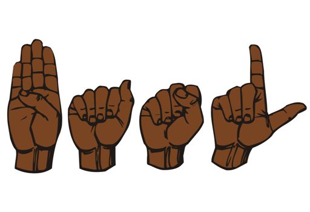

# Speech to Sign Language App



This application allows users to convert speech to sign language and visualize the sign language gestures using images and GIFs. It is built using the Streamlit framework.

## Prerequisites

Before running the app, make sure you have the following dependencies installed:

- Python 3.x
- Streamlit
- SpeechRecognition
- Sounddevice
- Wavio

You can install these dependencies using `pip`:

```bash
pip install streamlit speechrecognition sounddevice wavio
```

## Getting Started

1. Clone this repository to your local machine:

```bash
git clone https://github.com/yourusername/speech-to-sign-language.git
cd speech-to-sign-language
```

2. Run the Streamlit app:

```bash
streamlit run app.py
```

3. Access the app in your web browser at `http://localhost:8501`.

## Usage

1. Upon launching the app, you will see a user-friendly interface that offers three options:
   - **Record Audio**: Click this button to record your voice. After recording, it will be converted to text and displayed in sign language.
   - **Text Input**: Type or paste text, then click "Submit" to see the sign language representation of the text.
   - **Sign to Speech** (under development): This feature will be available in future versions.

2. **Record Audio**:
   - Click the "Click to Record" button.
   - Speak into your microphone for a few seconds.
   - The recorded audio will be converted to text and displayed in sign language gestures.

3. **Text Input**:
   - Enter your text in the input box.
   - Click "Submit."
   - The text will be displayed in sign language gestures.

## Contributing

If you'd like to contribute to this project, please follow these steps:

1. Fork the repository.
2. Create a new branch for your feature or bug fix.
3. Make your changes and test them.
4. Submit a pull request.


## Acknowledgments
- Special thanks to the [SpeechRecognition](https://pypi.org/project/SpeechRecognition/) library for its crucial role in converting spoken language to text.
